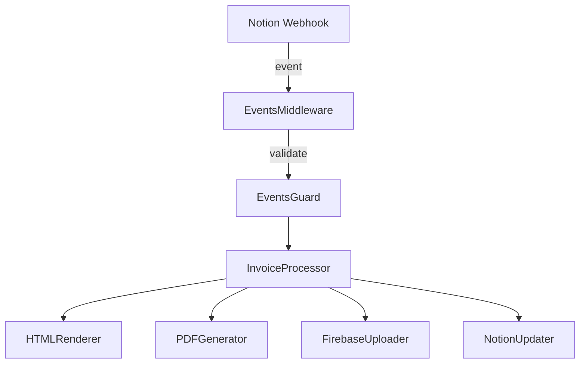

# 📘 Notion Invoicomat

> Automated invoice processing system powered by **NestJS**, **Firebase Functions**, and **Notion API**.  
> Designed to handle invoices end-to-end: from Notion webhook events → rendering → PDF generation → Firebase Storage upload.

---

## 📑 Table of Contents
- [✨ Features](#-features)  
- [🏗 Architecture](#-architecture)  
- [📂 Project Structure](#-project-structure)  
- [⚙️ Configuration](#️-configuration)  
- [📦 Installation](#-installation)  
- [🚀 Usage](#-usage)  
- [🧪 Development](#-development)  
- [🚢 Deployment](#-deployment)  
- [📚 API Documentation](#-api-documentation)  
- [🤝 Contributing](#-contributing)  
- [📄 License](#-license)  

---

## ✨ Features
- ✅ **Webhook verification** with HMAC signatures  
- 🧾 **Invoice lifecycle automation** (Notion → PDF → Firebase)  
- 🎨 **Nunjucks + TailwindCSS renderer** for invoice templates  
- 📤 **PDF generation** via [Adobe PDF Services API](https://developer.adobe.com/document-services/apis/pdf-services/)
- ☁️ **Firebase Storage integration**  
- 🗝 **Google Secret Manager** for secure token storage  

---

## 🏗 Architecture



- **EventsMiddleware / Guard** → validate Notion webhook requests  
- **InvoiceProcessorService** → orchestrates invoice flow  
- **HTMLRenderer** → Nunjucks + TailwindCSS rendering  
- **PDFGenerator** → Chrome headless PDF generation  
- **FirebaseUploader** → uploads files to Firebase Storage  
- **SecretManagerService** → fetches/stores sensitive tokens  

---

## 📂 Project Structure

```txt
functions/
├── src/
│   ├── app.module.ts
│   ├── main.ts
│   ├── config/
│   │   └── configuration.ts
│   ├── secret-manager/
│   │   └── secret-manager.service.ts
│   ├── notion/
│   │   ├── notion.module.ts
│   │   ├── notion.service.ts
│   │   ├── events.middleware.ts
│   │   └── events.guard.ts
│   ├── renderer/
│   │   ├── html-document.service.ts
│   │   └── templates/
│   ├── invoice-processor/
│   │   └── invoice-processor.service.ts
│   └── slack/
│       └── slack.service.ts
```

---

## ⚙️ Configuration

Environment variables (via **Google Secret Manager** or `.env`):

- `GCLOUD_PROJECT` → GCP project ID  
- `NOTION_VERIFICATION_TOKEN` → Notion webhook verification secret  
- `NOTION_API_KEY`→ Notion API key
- `PDF_SERVICES_CLIENT_ID` → Adobe PDF Services client id API 
- `PDF_SERVICES_CLIENT_SECRET` → Adobe PDF Services client key API

---

## 📦 Installation

```bash
pnpm install
```

---

## 🚀 Usage

### 🔔 Webhook Handling
- Incoming requests from **Notion** are validated with `NotionEventsGuard`  
- HMAC SHA256 signatures verified against `NOTION_VERIFICATION_TOKEN`  

### 🧾 Invoice Workflow
1. **Event received** from Notion  
2. **Rendered** into HTML with Tailwind + Nunjucks  
3. **PDF generated**  
4. **Uploaded** to Firebase Storage  
5. **Updated** in Notion  

---

## 🧪 Development

Start local functions emulator:

```bash
pnpm build
firebase emulators:start
```

Lint & format:

```bash
pnpm lint
pnpm format
```

---

## 🚢 Deployment

```bash
firebase deploy --only functions
```

---

## 📚 API Documentation

Endpoints exposed via Firebase Functions:

- `POST /notion/events` → webhook handler  
- (internal) `InvoiceProcessorService` handles pipeline:  
  `fromNotionPage → generatePdf → uploadToFirebase → updateNotionPage`  

---

## 🤝 Contributing

Contributions welcome! Please open PRs with clear description and tests.

---

## 📄 License

MIT License  
