# Notion InvoicOMat 🧾

[](https://nodejs.org/)
[](https://www.typescriptlang.org/)
[](https://nestjs.com/)
[](https://firebase.google.com/products/functions)
[](LICENSE)

A serverless microservice for automated PDF invoice generation from Notion pages with Slack integration and Firebase Storage. Built with NestJS, deployed as Firebase Cloud Functions.

## Table of Contents

- [Overview](#overview)
- [Features](#features)
- [Architecture](#architecture)
- [Installation](#installation)
- [Configuration](#configuration)
- [Usage](#usage)
- [Project Structure](#project-structure)
- [Technology Stack](#technology-stack)
- [Development](#development)
- [Deployment](#deployment)
- [API Documentation](#api-documentation)
- [Troubleshooting](#troubleshooting)
- [Contributing](#contributing)
- [License](#license)

## Overview

**Notion InvoicOMat** streamlines invoice generation by automating the conversion of structured Notion database entries into professional PDF invoices. The system integrates with Slack for triggering and uses Firebase for serverless execution and file storage.

### How it Works

1. **Data Management**: Invoice data is stored and managed in a Notion database
2. **Trigger**: Slack automation sends webhook requests when invoices are ready
3. **Processing**: Firebase Function retrieves data from Notion API
4. **Generation**: HTML templates are rendered with Nunjucks and styled with Tailwind CSS
5. **Conversion**: HTML is converted to PDF using Puppeteer
6. **Storage**: Generated PDFs are uploaded to Firebase Storage
7. **Completion**: Notion page is updated with the PDF download link

## Features

### 🚀 Core Features
- **Automated PDF Generation** from Notion database entries
- **Slack Integration** for webhook-triggered invoice processing
- **Smart Notifications** with success/error messages sent back to Slack
- **Multi-language Support** (English/Polish) with i18n
- **Currency Conversion** with real-time exchange rates
- **Professional Templates** with customizable HTML/CSS styling
- **Cloud Storage** integration with Firebase Storage

### 🛠️ Technical Features
- **Serverless Architecture** with Firebase Cloud Functions
- **Type Safety** with full TypeScript coverage
- **Modular Design** using NestJS dependency injection
- **Modern Styling** with Tailwind CSS compilation
- **Font Integration** with Inter Variable font
- **Error Handling** with comprehensive logging
- **CI/CD Pipeline** with GitHub Actions

## Architecture

```mermaid
graph TB
    %% External Services Layer
    subgraph EXT["🌐 External Services"]
        direction TB
        Slack["💬 Slack Webhook<br/>Automation Trigger"]
        Notion["📝 Notion API<br/>Database & CMS"]
        Firebase["☁️ Firebase Storage<br/>File Storage"]
        Exchange["💱 Exchange Rate API<br/>Currency Conversion"]
    end
    
    %% Firebase Cloud Function Container
    subgraph FUNC["🔥 Firebase Cloud Function"]
        direction TB
        
        %% Entry Point
        subgraph ENTRY["📡 API Gateway"]
            Controller["🎯 SlackController<br/>HTTP Endpoint"]
        end
        
        %% NestJS Application Core
        subgraph NEST["⚡ NestJS Application"]
            direction TB
            
            %% Core Business Logic
            subgraph CORE["🏗️ Core Services"]
                direction TB
                SlackService["💬 SlackService<br/>Event Processing"]
                InvoiceProcessor["⚙️ InvoiceProcessor<br/>Main Orchestrator"]
                NotionService["📝 NotionService<br/>API Client"]
                InvoiceRenderer["🖨️ InvoiceRenderer<br/>PDF Generation"]
                FirebaseStorage["☁️ FirebaseStorage<br/>Upload Manager"]
            end
            
            %% Utility Services
            subgraph UTIL["🛠️ Utility Services"]
                direction TB
                HtmlToPdf["📄 HtmlToPdf<br/>Puppeteer Engine"]
                HtmlDocument["🎨 HtmlDocument<br/>Template Engine"]
                ExchangeService["💱 ExchangeService<br/>Rate Calculator"]
                I18nService["🌍 I18nService<br/>Localization"]
            end
        end
    end
    
    %% Data Flow - Primary Path
    Slack -.->|"1️⃣ Webhook Event"| Controller
    Controller -.->|"2️⃣ Process Event"| SlackService
    SlackService -.->|"3️⃣ Extract Page ID"| InvoiceProcessor
    
    %% Data Retrieval
    InvoiceProcessor -.->|"4️⃣ Fetch Data"| NotionService
    NotionService -.->|"5️⃣ API Call"| Notion
    
    %% PDF Generation Pipeline
    InvoiceProcessor -.->|"6️⃣ Render PDF"| InvoiceRenderer
    InvoiceRenderer -.->|"7️⃣ Get Rates"| ExchangeService
    ExchangeService -.->|"8️⃣ API Call"| Exchange
    InvoiceRenderer -.->|"9️⃣ Generate HTML"| HtmlDocument
    InvoiceRenderer -.->|"🔟 Convert to PDF"| HtmlToPdf
    
    %% Storage & Completion
    InvoiceProcessor -.->|"1️⃣1️⃣ Upload PDF"| FirebaseStorage
    FirebaseStorage -.->|"1️⃣2️⃣ Store File"| Firebase
    InvoiceProcessor -.->|"1️⃣3️⃣ Update URL"| NotionService
    NotionService -.->|"1️⃣4️⃣ Update Page"| Notion
    
    %% Styling for modern presentation
    classDef external fill:#e3f2fd,stroke:#1976d2,stroke-width:3px,color:#000,stroke-dasharray: 5 5
    classDef controller fill:#fff3e0,stroke:#f57c00,stroke-width:3px,color:#000,font-weight:bold
    classDef core fill:#f3e5f5,stroke:#7b1fa2,stroke-width:3px,color:#000,font-weight:bold
    classDef utility fill:#e8f5e8,stroke:#388e3c,stroke-width:3px,color:#000
    classDef container fill:#fafafa,stroke:#616161,stroke-width:2px,color:#000,font-weight:bold
    classDef subcontainer fill:#ffffff,stroke:#9e9e9e,stroke-width:1px,color:#000
    
    %% Apply styles
    class Slack,Notion,Firebase,Exchange external
    class Controller controller
    class SlackService,InvoiceProcessor,NotionService,InvoiceRenderer,FirebaseStorage core
    class HtmlToPdf,HtmlDocument,ExchangeService,I18nService utility
    class EXT,FUNC container
    class ENTRY,NEST,CORE,UTIL subcontainer
```



## Installation

### Prerequisites

- **Node.js** 22 or higher
- **pnpm** package manager
- **Firebase CLI** for deployment
- **Notion API** access token
- **Slack App** with webhook capabilities

### Setup

1. **Clone the repository**
   ```bash
   git clone <repository-url>
   cd notion-invoicomat
   ```

2. **Install dependencies**
   ```bash
   cd functions
   pnpm install
   ```

3. **Set up Firebase project**
   ```bash
   firebase login
   firebase init functions
   ```

4. **Configure environment variables**
   ```bash
   cp functions/.env.example functions/.env
   # Edit .env file with your API keys
   ```

## Configuration

### Environment Variables

Create a `.env` file in the `functions` directory:

```bash
# Required
NOTION_API_KEY=your_notion_integration_token


# Optional - for Slack notifications about processing status
SLACK_WEBHOOK_URL=your_slack_webhook_url
```

### Firebase Secrets

For production deployment, store sensitive data as Firebase secrets:

```bash
firebase functions:secrets:set NOTION_API_KEY
firebase functions:secrets:set SLACK_WEBHOOK_URL
```

### Notion Database Setup

Your Notion database should include the following properties:
- `invoice_number` (Title)
- `issue_date` (Date)
- `seller` (Relation to seller database)
- `client` (Relation to client database)
- `entries` (Relation to line items database)
- `currency` (Select: PLN, USD, EUR)
- `invoice_pdf` (URL - populated by the service)

### Slack Integration

1. Create a Slack App with webhook permissions
2. Set up workflow automation to send POST requests to your Firebase Function
3. Include Notion page URL in the webhook payload

## Usage

### Automatic Processing (Recommended)

1. **Prepare Invoice Data**: Fill out your Notion database with invoice details
2. **Trigger via Slack**: Use Slack automation to send webhook with Notion page URL
3. **Automatic Processing**: The system will:
   - Extract Notion page ID from Slack webhook
   - Fetch invoice data from Notion API
   - Generate HTML using Nunjucks templates
   - Convert to PDF with Puppeteer
   - Upload to Firebase Storage
   - Update Notion page with PDF link

### Manual Testing

For development and testing, you can invoke the function directly:

```bash
# Local development
cd functions
pnpm run serve

# Test webhook endpoint
curl -X POST http://localhost:5001/your-project/us-central1/webhook/slack/events \
  -H "Content-Type: application/json" \
  -d '{
    "event": {
      "type": "message",
      "blocks": [{
        "type": "section",
        "text": {
          "type": "mrkdwn",
          "text": "Invoice ready: https://notion.so/your-page-id"
        }
      }]
    }
  }'
```

### Workflow Example

1. **Create Invoice in Notion**: Add new row to invoice database
2. **Fill Required Fields**: Invoice number, date, client, line items
3. **Trigger Slack Automation**: Send message with Notion page URL
4. **Automatic Processing**: System processes invoice
5. **Receive PDF**: Download link appears in Notion page

## Project Structure

```
functions/
├── src/
│   ├── app/
│   │   ├── config/                    # Configuration module
│   │   │   ├── config.module.ts       # Global configuration
│   │   │   └── configuration.ts       # Environment variables
│   │   ├── slack/                     # Slack webhook handling
│   │   │   ├── slack.controller.ts    # HTTP endpoints
│   │   │   ├── slack.service.ts       # Business logic
│   │   │   └── slack.module.ts        # Module definition
│   │   ├── invoice-processor/         # Core invoice processing
│   │   │   ├── invoice-processor.service.ts
│   │   │   └── invoice-processor.module.ts
│   │   ├── notion/                    # Notion API integration
│   │   │   ├── notion.service.ts      # API client wrapper
│   │   │   └── notion.module.ts
│   │   ├── invoice-renderer/          # PDF generation
│   │   │   ├── invoice-renderer.service.ts
│   │   │   ├── invoice-renderer.module.ts
│   │   │   └── templates/             # Nunjucks templates
│   │   │       └── invoice.njk        # Main invoice template
│   │   ├── html-document/             # HTML generation utilities
│   │   │   ├── html-document.service.ts
│   │   │   ├── template-engine/       # Template adapters
│   │   │   ├── css-compiler/          # Tailwind CSS integration
│   │   │   └── font-inliner/          # Font embedding
│   │   ├── html-to-pdf/               # PDF conversion
│   │   │   ├── html-to-pdf.service.ts # Puppeteer wrapper
│   │   │   └── html-to-pdf.module.ts
│   │   ├── firebase/                  # Firebase services
│   │   │   ├── firebase-storage.service.ts
│   │   │   └── firebase.module.ts
│   │   ├── exchange/                  # Currency conversion
│   │   │   ├── exchange.service.ts    # Exchange rate API
│   │   │   └── exchange.module.ts
│   │   ├── i18n/                      # Internationalization
│   │   │   ├── i18n.service.ts
│   │   │   ├── i18n.module.ts
│   │   │   └── locales/               # Translation files
│   │   │       ├── en/                # English translations
│   │   │       └── pl/                # Polish translations
│   │   ├── shared/                    # Shared utilities
│   │   ├── app.module.ts              # Root application module
│   │   └── main.ts                    # NestJS bootstrap
│   └── index.ts                       # Firebase Function entry point
├── package.json                       # Dependencies and scripts
├── tsconfig.json                      # TypeScript configuration
├── nest-cli.json                      # NestJS CLI configuration
├── eslint.config.mjs                  # ESLint configuration
└── .env.example                       # Environment variables template
```

## Technology Stack

### Core Technologies
- **Runtime**: Node.js 22
- **Language**: TypeScript 5.8.3
- **Framework**: NestJS 11.1.3
- **Platform**: Firebase Cloud Functions

### Key Dependencies
- **Template Engine**: Nunjucks 3.2.4
- **CSS Framework**: Tailwind CSS 3.4.17
- **PDF Generation**: Puppeteer 24.11.2
- **API Client**: @notionhq/client 3.1.3
- **Font Loading**: @fontsource-variable/inter 5.2.6
- **Internationalization**: intl-messageformat 10.7.16

### Development Tools
- **Linting**: ESLint with @antfu/eslint-config
- **Package Manager**: pnpm
- **Deployment**: GitHub Actions

## Development

### Local Development

1. **Start Firebase Emulator**
   ```bash
   cd functions
   pnpm run serve
   ```

2. **Watch Mode**
   ```bash
   pnpm run build:watch
   ```

3. **Linting**
   ```bash
   pnpm run lint
   ```

### Code Quality

The project uses ESLint with Antfu's configuration for consistent code style:
- TypeScript strict mode enabled
- Consistent import style (no-type-imports)
- 1TBS brace style enforced
- Automatic formatting on save

### Testing Webhooks

Use tools like ngrok for local webhook testing:

```bash
# Install ngrok
npm install -g ngrok

# Expose local Firebase emulator
ngrok http 5001

# Use ngrok URL in Slack webhook configuration
```

## Deployment

### Automatic Deployment

The project uses GitHub Actions with Workload Identity Federation for secure, keyless authentication:

```yaml
# .github/workflows/deploy.yml
on:
  push:
    branches: [main]
  workflow_dispatch:

permissions:
  contents: read
  id-token: write  # Required for WIF
```

**Setup Requirements:**
1. **Google Cloud Workload Identity Federation** configured
2. **GitHub repository** connected to Google Cloud project
3. **Service Account** with Firebase deployment permissions

### Manual Deployment

```bash
# Authenticate with Google Cloud
gcloud auth login

# Build and deploy
cd functions
pnpm run build
firebase deploy --only functions,storage --project your-project-id
```

### Environment Setup

1. **Configure Workload Identity Federation**
   ```bash
   # Already configured in your Google Cloud Console
   # Workload Identity Pool: github-pool
   # Provider: github
   # Service Account: firebase-adminsdk-fbsvc@mikita-dev-f86aa.iam.gserviceaccount.com
   ```

2. **Set Firebase secrets**
   ```bash
   firebase functions:secrets:set NOTION_API_KEY="your_notion_token"
   ```

3. **Configure storage rules**
   ```bash
   firebase deploy --only storage
   ```

## API Documentation

### Webhook Endpoints

#### POST `/slack/events`

Handles Slack webhook events for invoice processing.

**Request Body:**
```json
{
  "type": "url_verification",
  "challenge": "challenge_string"
}
```

Or:

```json
{
  "event": {
    "type": "message",
    "blocks": [{
      "type": "section",
      "text": {
        "type": "mrkdwn",
        "text": "Invoice ready: https://notion.so/page-id"
      }
    }]
  }
}
```

**Response:**
```json
{
  "status": "ok"
}
```

### Processing Flow

1. **Slack URL Verification**: Handled automatically by interceptor
2. **Page ID Extraction**: Parses Notion URL from Slack message
3. **Data Retrieval**: Fetches invoice data from Notion API
4. **PDF Generation**: Creates PDF using templates and styling
5. **Storage Upload**: Saves PDF to Firebase Storage
6. **Notion Update**: Updates original page with PDF URL

### Debug Mode

Enable detailed logging by setting environment variables:

```bash
DEBUG=true
LOG_LEVEL=debug
```

### Performance Optimization

- **Memory**: Increase function memory allocation for PDF generation
- **Timeout**: Set appropriate timeout values for external API calls
- **Caching**: Consider implementing exchange rate caching for production

## Contributing

### Guidelines

1. **Fork** the repository
2. **Create** feature branch (`git checkout -b feature/amazing-feature`)
3. **Commit** changes (`git commit -m 'Add amazing feature'`)
4. **Push** to branch (`git push origin feature/amazing-feature`)
5. **Open** Pull Request

### Development Standards

- Follow existing code style (ESLint configuration)
- Add tests for new functionality
- Update documentation for API changes
- Ensure all CI checks pass

### Code Review Process

- All changes require code review
- Automated tests must pass
- Documentation updates required for user-facing changes

## License

This project is licensed under the MIT License - see the [LICENSE](LICENSE) file for details.

---

**Built with ❤️ using NestJS, Firebase, and modern web technologies.**

For questions or support, please open an issue in the GitHub repository.
